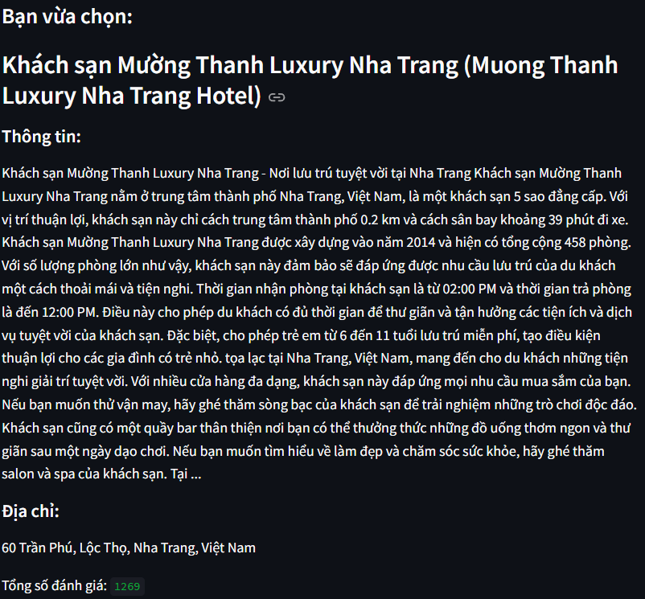
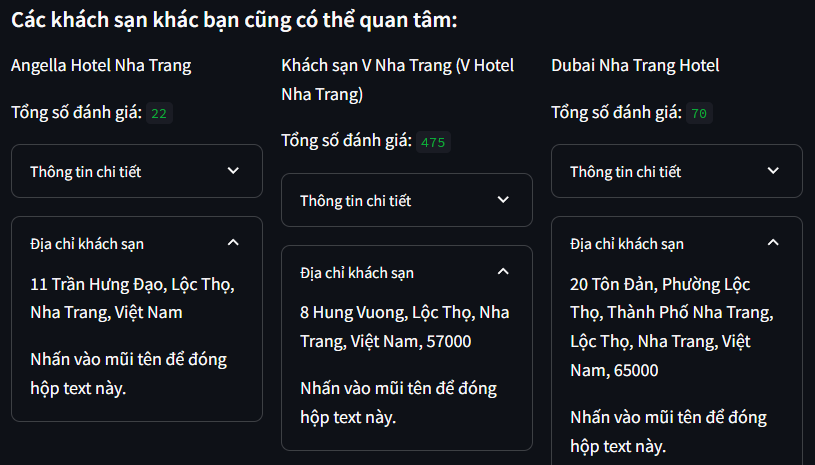
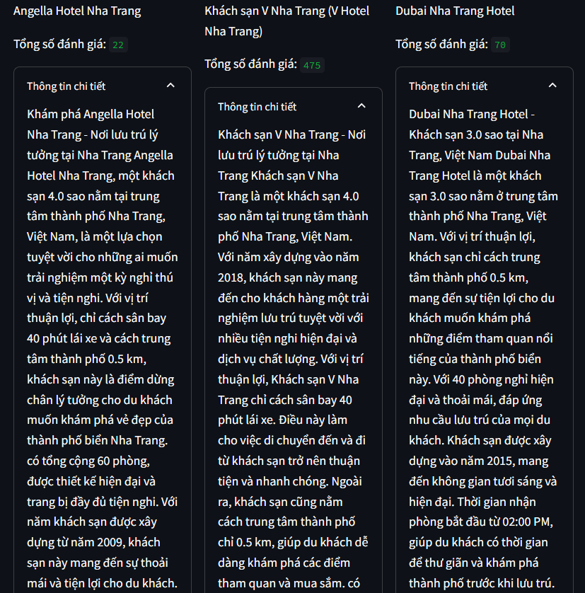

# Agoda Recommender System
## Giới thiệu
Agoda Recommender System là một hệ thống đề xuất giúp người dùng tìm thấy những khách sạn và resort phù hợp nhất dựa trên sở thích cá nhân và hành vi của họ. Hệ thống sử dụng hai phương pháp chính:
* Content-Based Filtering: Đề xuất khách sạn dựa trên các thuộc tính của khách sạn mà người dùng đã tương tác hoặc thể hiện sự quan tâm. Ví dụ, nếu bạn thích các bộ phim hành động, hệ thống sẽ gợi ý các bộ phim hành động khác có nội dung tương tự.
* Collaborative Filtering: Đề xuất khách sạn dựa trên những người dùng khác có sở thích tương tự. Ví dụ, nếu người dùng A và B đều thích một nhóm sản phẩm giống nhau, và A thích một sản phẩm mới, thì sản phẩm đó có thể được đề xuất cho B.
## Đề xuất khách sạn
### Content-Based
Ví dụ khi chọn 1 khách sạn, giả sử chọn 'Khách sạn Mường Thanh Luxury Nha Trang (Muong Thanh Luxury Nha Trang Hotel)'

   
  <i>Thông tin khách sạn</i>

Đề xuất dựa trên thông tin chi tiết, địa chỉ của khách sạn đã chọn

   
  <i></i>

   
  <i>Thông tin chi tiết, địa chỉ của khách sạn được đề xuất</i>

### Collaborative Filtering
